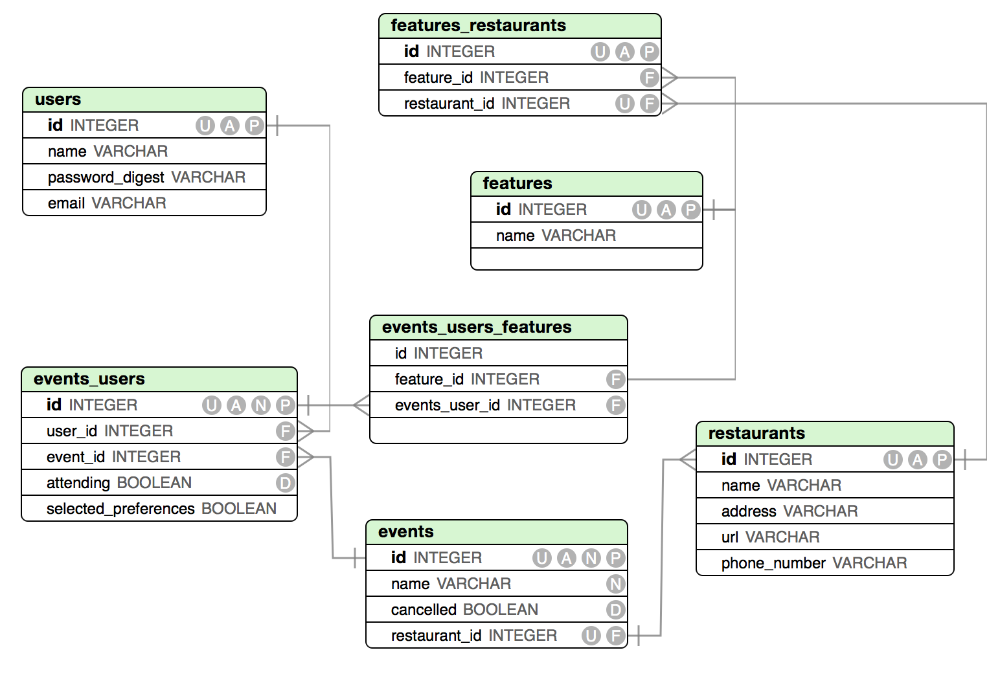

#Project 1 -EAT

#GA WDI DC December 2014

##Overview

>Where2Eat is an app that allows users to create an lunch or dinner event, invite other users, and get a restaurant recommendation generated behind the scenes by Ruby logic.

[visit Where2Eat](https://desolate-plateau-3067.herokuapp.com/"Where2Eat")

##Technologies Used
* Ruby 2.1.2
* Sinatra
* Active Record
* PostgreSQL Database
* User authentication & authorization from gem bcrypt-ruby and "has_user_password".
* gem sinatra-flash installed to show flash messages to the user.
* gem pony and Heroku add-on Sendgrid to send email.

#User Stories Completed
* User can sign up / sign in.
* User can create an event.
* User can save preferences for a restaurant.
* Use can invite friends to an event using Pony.
* User can delete an event.
* User can see the profile page of the restaurant that was chosen.

* [Complete list of user stories here](https://github.com/minmcknight/eat/issues?q=is%3Aissue+)"User Stories on Github"

##ERD

##What's next?
* See the app with restaurant data from Yelp api.
* Users will be able to comment on the events page.
* Users will be able to comment on the Restaurant page, which will then populate the Restaurant profile page.
* Link it through social media, so users can invite people on Facebook.
* Add a map through Google Maps and get directions to the restaurant.
* Add field called organizer to keep track of who created the event.
* run rspec

##Set up
    rake db:create
    rake db:migrate

